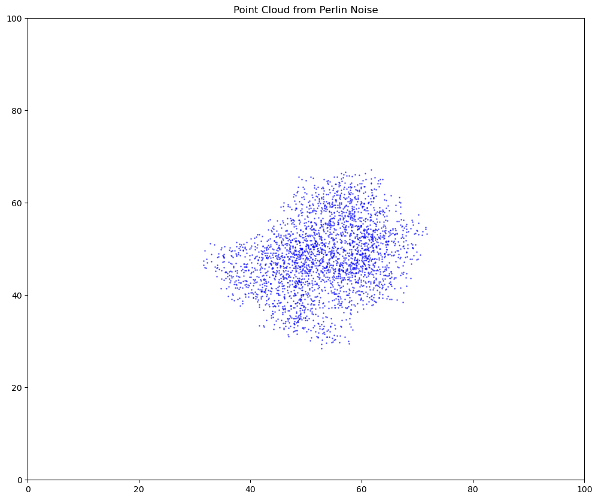

# Data Generator Logic

This document summarizes the logic and workflow for generating random but meaningful test data for the AI-CareerGuide project, using both Java and Python components.

---

## Overview

The data generation process combines structured random sampling with spatial logic derived from "cloud maps" (point clouds) to produce realistic and internally consistent synthetic data for students and employment records.

---

## Step-by-Step Workflow

### 1. **Generate Cloud Maps (Python: `dataPointsAllocator.ipynb`)**

- **Perlin Noise Map:**  
  Uses Perlin noise to create a 2D grid representing a landscape with natural-looking clusters and gradients.
- **Central Weighting:**  
  Applies a weighting function to emphasize the center or other regions, shaping the distribution of points.
- **Point Cloud Extraction:**  
  Converts the noise map into a set of (x, y) points, with density proportional to the "height" (probability) at each location.
- **Export:**  
  Saves the generated point cloud as a CSV file (e.g., `pointCoordinates1.csv`).

---

### 2. **Load Cloud Map and Data Sources (Java: `cloudMapLoader.java` & `testDataGenerator.java`)**

- **Cloud Map Loader:**  
  - Reads the CSV file containing the point cloud.
  - Provides methods to access all points and randomly sample a point.
- **Data Sources:**  
  - Loads lists of possible first names, last names, majors, emails, nationalities, company names, and positions from CSV files.

---

### 3. **Generate Students and Employment Records (Java: `testDataGenerator.java`)**

- **Student Generation:**  
  - For each student, randomly sample a point from the cloud map.
  - Use the x and y values of the point to logically assign:
    - `major`, `nationality`, `homeLand` (using modular arithmetic or mapping)
    - `score` (maps x value to a 0–100 range)
  - Other fields (name, email) are randomly selected from lists.
- **Employment Record Generation:**  
  - For each employment record, use the same point as the corresponding student (ensuring logical linkage).
  - Use the y value to generate a `salary` (mapped to a realistic range, e.g., 30,000–100,000).
  - Other fields (company, position, dates, etc.) are assigned using a mix of random selection and mapping.

---

### 4. **Output**

- **CSV Export:**  
  - Writes the generated students and employment records to `student.csv` and `employRecord.csv` for downstream use.

---

## Key Points

- **Spatial Logic:**  
  The use of cloud maps ensures that generated data is not purely random, but follows meaningful patterns (e.g., clusters, gradients, or correlations).
- **Reproducibility:**  
  By saving and reusing the same cloud map, data generation can be made consistent across runs.
- **Extensibility:**  
  Different cloud maps can be used to simulate different data distributions or scenarios.

---

## References

- `src/dataPointsAllocator.ipynb` (Python notebook for cloud map generation)
- `src/cloudMapLoader.java` (Java class for loading and sampling cloud maps)
- `src/testDataGenerator.java` (Java class for generating and exporting data)