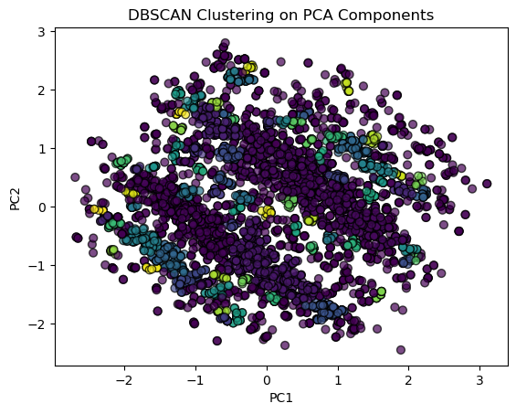
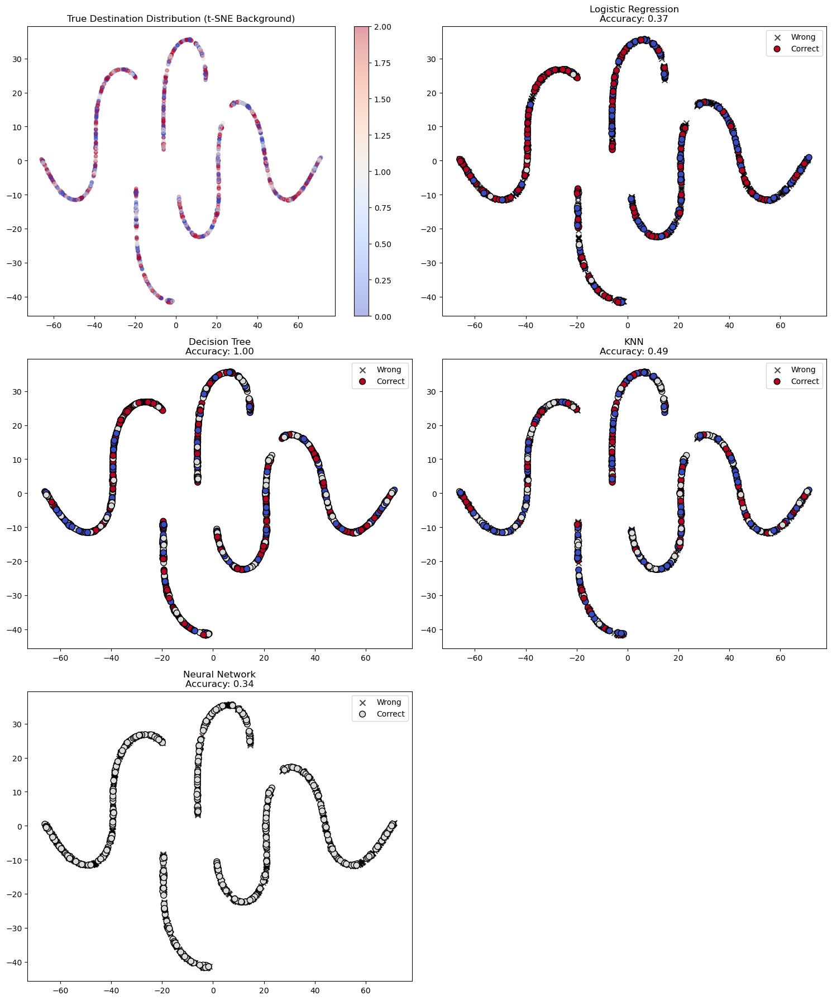

# AI Career Guide Project Outcomes

## Executive Summary

The AI Career Guide project demonstrates innovative approaches to student career path analysis and prediction through artificial intelligence and data science. This document outlines our key achievements and potential applications for university career offices.

## Key Innovations

### 1. Realistic Data Simulation

We developed a sophisticated data generation system that creates realistic student and employment records using:

- **Perlin Noise-Based Distribution**: Implemented natural clustering of data points
```python
# From PureCode_dataPointsAllocator.py
height = np.zeros((size, size))
for i in range(size):
    for j in range(size):
        height[i][j] = pnoise2(xv[i,j], yv[i,j], 
                              octaves=octaves,
                              persistence=0.5,
                              lacunarity=2.0,
                              base=0)
```

- **Logical Data Relationships**: Created correlations between academic performance, career choices, and outcomes
```java
// From testDataGenerator.java
int score = mapRange(point[0], xMinMax[0], xMinMax[1], 0, 100);
int salary = mapRange(point[1], yMinMax[0], yMinMax[1], 30000, 100000);
```

### 2. Pattern Analysis & Insights

Our analysis tools provide valuable insights into student career patterns:

- **Clustering Analysis**: Using advanced algorithms to identify distinct career path patterns
```python
# From PureCode_visuallizeDemo.py
dbscan = DBSCAN(eps=0.09, min_samples=10)
merged['pca_cluster'] = dbscan.fit_predict(principal_components)
```



While our clustering analysis shows promising differentiation between career paths, the interpretation of these clusters requires deeper investigation:

- **Cluster Interpretation Challenges**
  - Understanding what each cluster represents in terms of career trajectories
  - Identifying the key features that define cluster boundaries
  - Determining the practical significance of cluster membership

```python
# Current limitation in cluster interpretation
cluster_meanings = {
    'cluster_0': 'Potentially represents traditional career paths',
    'cluster_1': 'May indicate entrepreneurial trajectories',
    'cluster_n': 'Further analysis needed for conclusive interpretation'
}
```

- **Feature Correlation**: Understanding relationships between:
  - Academic performance and career outcomes
  - Major selection and salary ranges
  - Geographical preferences and job placement

### 3. Predictive Modeling

Implemented multiple machine learning models for career path prediction:

```python
# From PureCode_visuallizeDemo.py
models = {
    "Logistic Regression": LogisticRegression(),
    "Decision Tree": DecisionTreeClassifier(),
    "KNN": KNeighborsClassifier(),
    "Neural Network": MLPClassifier()
}
```


Our predictive models offer valuable insights including:

- **Career Trajectory Forecasting**
  - Salary progression predictions based on academic performance
  - Industry sector alignment based on major and coursework
  - Geographic mobility predictions

- **Risk Assessment**
  - Early identification of career path misalignment
  - Detection of skill gaps for desired career paths
  - Academic performance impact on career outcomes

- **Opportunity Identification**
  - Emerging career paths suited to student profiles
  - Alternative career routes based on skill transferability
  - Internship recommendations for optimal career progression

The models achieve this by analyzing correlations between:
```python
# Key feature relationships analyzed
features = [
    'academic_performance',
    'major_specialization',
    'internship_experience',
    'geographical_preference',
    'industry_trends'
]
```

### 4. AI-Powered Insights (Unfinished)

Integration of specialized language models to translate complex data patterns into actionable insights:

- **Natural Language Understanding**: Interpreting clustering patterns and career trajectories
- **Automated Report Generation**: Converting statistical analysis into readable guidance
- **Personalized Recommendations**: Contextual career path explanations

```python
# Example of AI interpretation implementation
def generate_career_insights(student_data, model_predictions):
    # Fine-tuned LLM processes complex data patterns
    clustering_insights = llm.analyze(model_predictions.clusters)
    career_trajectory = llm.interpret(model_predictions.path)
    
    return {
        'personalized_guidance': clustering_insights,
        'career_explanation': career_trajectory,
        'action_items': llm.generate_recommendations(student_data)
    }
```

## Applications

### 1. Career Office Enhancement
- Data-driven career counseling
- Trend identification in student placement
- Resource allocation optimization

### 2. Student Guidance
- Personalized career path recommendations
- Early intervention for at-risk students
- Major selection guidance

### 3. Industry Partnership
- Better matching of students with employers
- Identification of emerging career opportunities
- Strategic partnership development

## Future Potential

1. **Real-time Analysis**: Integration with live student data
2. **Extended Predictions**: Long-term career trajectory forecasting
3. **API Development**: Integration with existing university systems

## Conclusion

This project demonstrates the power of combining advanced data simulation, analysis, and machine learning to transform career guidance in higher education. The tools and insights developed here provide a foundation for data-driven decision-making in student career services.